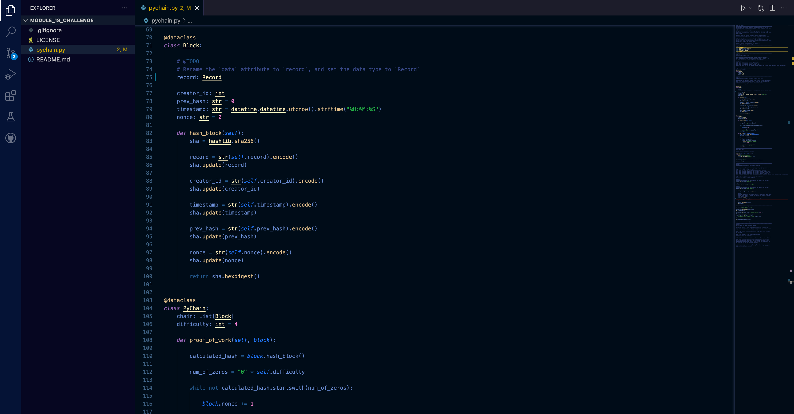

# PyChain Ledger/ Module 18 Challenge
---
This is a streamit application called PyChain Ledger used to record transaction data into a blockchain. 
## Technologies

This project uses python 3.7 with the following packages:

* [Pandas](https://github.com/pandas-dev/pandas) - Pandas is an open-source library that offers easy-to-use data analysis tools for Python.

* [Streamlit](https://streamlit.io) 

* [hashlib](https://docs.python.org/3/library/hashlib.html) 


 
---

## Installation Guide

Before running the application first install the following:


* [Install] Anaconda with Python 3.7+(https://docs.anaconda.com/anaconda/install/)
You should always be in a conda dev environment when launching JupyterLab.


## Usage

To view the pychain.py open file via VSCode

```conda activate dev
pip install streamlit
cd <location of (pychain.py)>
```

Upon launching the Jupyter Lab NOTEBOOK you will be greeted with the following prompts.



---

## Contributors

Brought to you by MartyCodes333 (martique.henton@gmail.com) with the help of 2021 UW FinTech Bootcamp Instructors, TA's and Fellow Classmates